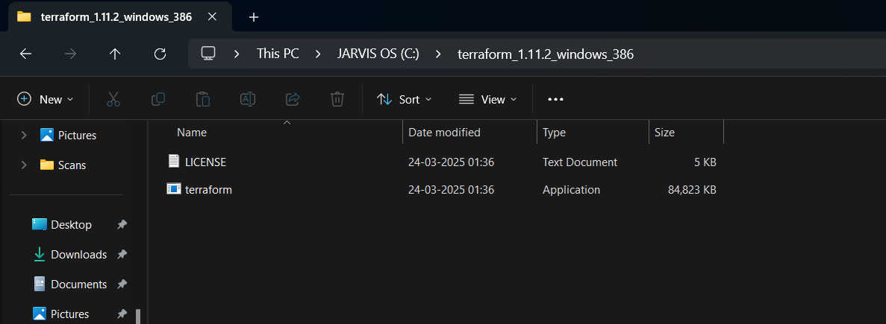
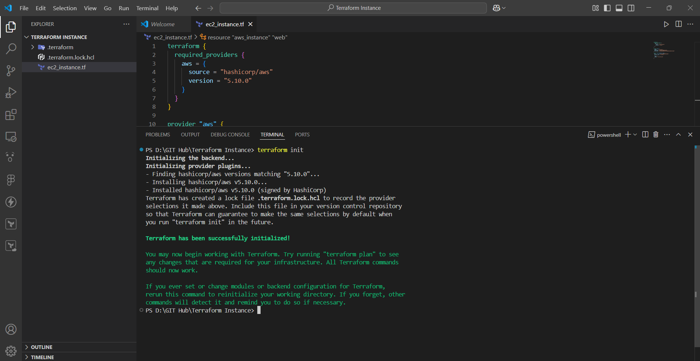
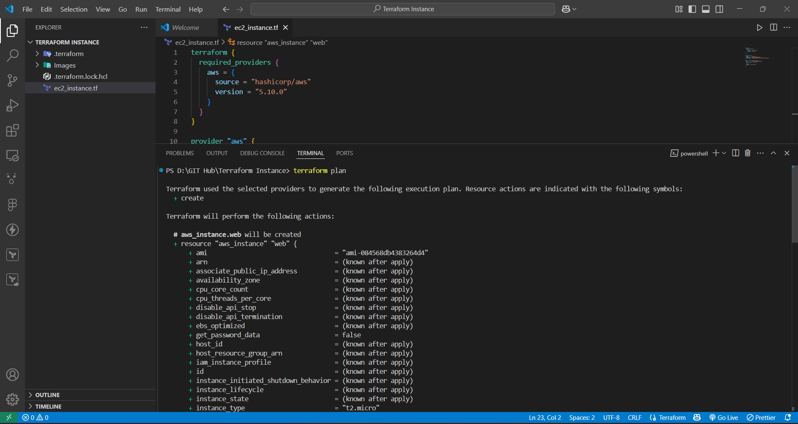
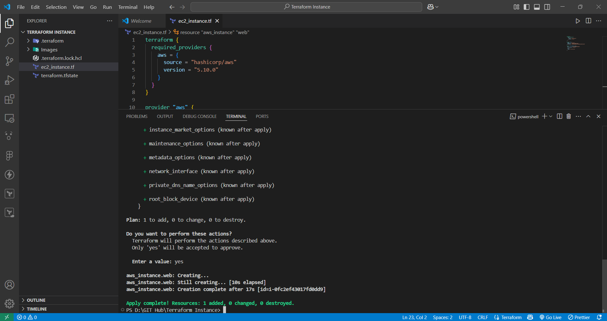
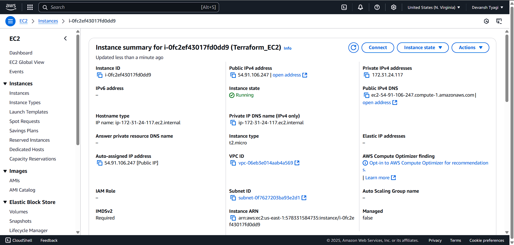

# Terraform EC2 Instance Setup with AWS

### 1. **Introduction**

In this guide, we will walk you through the process of provisioning an EC2 instance using Terraform on AWS. We will go step-by-step, from setting up your environment to writing and executing the Terraform script.

---

### 2. **Prerequisites**

Before we begin, ensure you have the following installed:

- **Terraform**: The tool used to define and manage infrastructure as code.
- **VS Code**: A code editor to write your Terraform scripts.

---

### 3. **Definitions**

- **Terraform**: A tool for provisioning and managing infrastructure as code. It allows you to define your infrastructure in a declarative configuration language and then provision, modify, or destroy it using commands.
- **AWS EC2 (Elastic Compute Cloud)**: A scalable cloud computing service from Amazon Web Services. EC2 instances are virtual machines running on AWS infrastructure.

- **AMI (Amazon Machine Image)**: A pre-configured template that contains an operating system and software configuration for launching EC2 instances.

---

Ah, I see! Since you're using your AWS credentials directly within the `.tf` file, you don't need to install or configure the AWS CLI to use Terraform with AWS.

In this case, your `provider "aws"` block in the `.tf` file contains the necessary AWS credentials directly, which Terraform uses to authenticate and provision resources. This is perfectly fine, especially if you don't need to use the AWS CLI for other tasks like managing AWS resources from the command line.

### Updated Links and Notes

Since you did not install the AWS CLI, I'll revise the README to exclude the CLI installation step. Here's the updated section for **Setting Up Your Environment**:

---

### 4. **Setting Up Your Environment**

#### 4.1. **Install Terraform**

- Go to the [Terraform download page](https://www.terraform.io/downloads) and select the appropriate version for Windows.
- **Steps:**

  1. Download the zip file.
  2. Extract the contents to a directory (e.g., `C:\terraform`).
  3. Add `C:\terraform` to the system's `PATH` environment variable.

  

#### 4.2. **Set up VS Code**

- Install [Visual Studio Code](https://code.visualstudio.com/) if you don't have it already.
- Install the **Terraform extension** in VS Code for syntax highlighting and auto-completion.

#### 4.3. **Configure AWS Credentials in `.tf` File**

Instead of configuring the AWS CLI, you can directly specify your AWS credentials (Access Key and Secret Key) in the provider block of your `.tf` file like this:

```hcl
provider "aws" {
  region     = "us-east-1"
  access_key = "<your-access-key>"
  secret_key = "<your-secret-key>"
}
```

**Note**: It is highly recommended **not to hard-code** your AWS credentials directly into your `.tf` file for security reasons. Instead, you should use environment variables or AWS IAM roles when possible.

For security best practices, consider using one of the following methods:

- **AWS IAM Roles** (if running from EC2 instances).
- **Environment Variables** (`AWS_ACCESS_KEY_ID` and `AWS_SECRET_ACCESS_KEY`).
- **AWS Shared Credentials File** (`~/.aws/credentials`).

---

### 5. **Writing the Terraform Script**

Create a new file named `ec2_instance.tf` and add the following content:

```hcl
terraform {
  required_providers {
    aws = {
      source = "hashicorp/aws"
      version = "5.10.0"
    }
  }
}

provider "aws" {
  region     = "us-east-1"
  access_key = "<access-key>"
  secret_key = "<secret-key>"
}

resource "aws_instance" "web" {
  ami           = "ami-084568db4383264d4"
  instance_type = "t2.micro"

  tags = {
    Name = "Terraform_EC2"
  }
}
```

- **Terraform Block**: Specifies the AWS provider and its version.
- **Provider Block**: Contains your AWS credentials and the region.
- **Resource Block**: Defines an EC2 instance resource, including the AMI, instance type, and tags.

---

### 6. **Initialize and Apply Terraform Configuration**

#### 6.1. **Initialize Terraform**

Open a terminal in the same directory as your `ec2_instance.tf` file and run the following command to initialize the Terraform configuration:

```bash
terraform init
```

This command will download the necessary provider plugins and prepare your working directory for Terraform commands.

- **What happens**:
  - Downloads the AWS provider plugin.
  - Prepares the backend (where Terraform stores its state) and configures it.



#### 6.2. **Run Terraform Plan**

The `terraform plan` command allows you to preview the changes Terraform will make to your infrastructure before actually applying them. This step is important for ensuring that everything will be provisioned correctly without any unintended modifications.

Run the following command to see the execution plan:

```bash
terraform plan
```

- **What happens**:
  - Terraform will display a detailed plan of what resources will be created, modified, or destroyed.
  - You can review the plan before proceeding to the next step.

Here’s an example of what the output might look like:

```plaintext
Plan: 1 to add, 0 to change, 0 to destroy.
```

- **Benefits**:
  - You can review the changes before they are actually made.
  - Helps catch mistakes or misconfigurations before deployment.



#### 6.3. **Apply the Configuration**

Once you're satisfied with the plan and the proposed changes, run the following command to apply the configuration:

```bash
terraform apply
```

Terraform will prompt you to confirm the execution of the plan by typing `yes`.

- **What happens**:
  - Terraform creates the resources defined in the configuration file (in this case, the EC2 instance).
  - It will show you an output of the created resources once the process is complete.



---

### Why `terraform plan` is important:

- **Preview Changes**: It helps you visualize the infrastructure changes before they are actually made.
- **Safety**: This step helps ensure you don’t accidentally modify or delete important resources.
- **Debugging**: It can help identify errors in the configuration or setup before applying changes.

---

### 7. **Verification**

Once Terraform finishes applying, it will output details about the created resources. You can log into your AWS console and verify the EC2 instance under the **EC2 Dashboard**.

You should see an instance named `Terraform_EC2` running with the `t2.micro` type.

## 

### 8. **Common Errors & Troubleshooting**

- **Invalid Credentials**: Ensure your AWS credentials are correct by running `aws configure` again.
- **Provider Not Found**: Make sure you have initialized Terraform using `terraform init`.
- **Insufficient Permissions**: Ensure your AWS IAM user has permission to create EC2 instances.

---

### 9. **Clean-up**

Once you're done, you can delete the resources by running:

```bash
terraform destroy
```

Terraform will ask for confirmation before destroying all created resources.

---

### 10. **Conclusion**

Congratulations! You've successfully provisioned an EC2 instance using Terraform on AWS. This guide provided a complete walk-through, from installation to execution and troubleshooting.

---

Here are the necessary links for the tools mentioned in the README guide:

### 1. **Download Terraform**

- Official Terraform download page:  
  [Terraform Downloads](https://www.terraform.io/downloads)

### 2. **Visual Studio Code (VS Code)**

- Download Visual Studio Code:  
  [Visual Studio Code](https://code.visualstudio.com/)

### 3. **Terraform Provider Documentation (AWS Provider)**

- Official Terraform AWS Provider documentation:  
  [Terraform AWS Provider](https://registry.terraform.io/providers/hashicorp/aws/latest/docs)

These links will help you with the installation and setup process. If you need more resources or help, feel free to ask!
